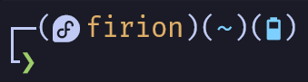
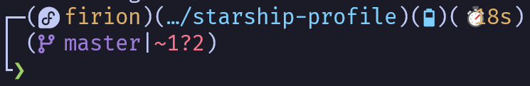
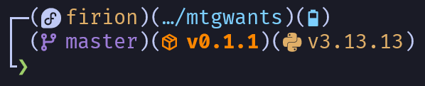

# starship-profile

My personal [Starship](https://starship.rs/) prompt configuration.

## Preview

The prompt is split into **three lines**:

| Line | Content |
|------|---------|
| `┌─` | OS icon · hostname (SSH only) · username · directory · battery · command duration |
| `│`  | Git branch · git status · active language/runtime modules |
| `└`  | Input character (green `❯` on success, red `❯` on error) |

### Simple example in home directory

### Example in this project with command time execution, git branch and status tracking

### Example in other project with git branch and status tracking, package version tracking and Python version and virtual environment tracking

> Screenshots taken with [FiraCode Nerd Font](https://github.com/ryanoasis/nerd-fonts/tree/master/patched-fonts/FiraCode) and [Tokyo Night](https://tokyonight.dev/) theme.

## Getting started

- **Install Starship** → [starship.rs/guide](https://starship.rs/guide/)
- **Configure Starship** → [starship.rs/config](https://starship.rs/config/)
- **Advanced options** (env vars, per-directory configs) → [starship.rs/advanced-config](https://starship.rs/advanced-config/)

Once Starship is set up, copy [`starship.toml`](./starship.toml) to `~/.config/starship.toml`, or point the `STARSHIP_CONFIG` environment variable to it — see [Config File Location](https://starship.rs/config/#config-file-location).

## Features

### Multi-line layout
The prompt uses box-drawing characters to visually separate context information from the input line, keeping things readable even when many modules are active.

### Battery indicator
Five threshold levels with colour-coded icons and distinct charging/discharging symbols:

| Charge | Style |
|--------|-------|
| ≤ 99 % | 🟢 Green |
| ≤ 80 % | 🔵 Blue |
| ≤ 60 % | 🩵 Cyan |
| ≤ 40 % | 🟡 Yellow |
| ≤ 20 % | 🔴 Red |

### OS detection
An OS-specific Nerd Font icon is shown for every major Linux distribution, macOS, and Windows — useful when working across multiple machines or inside containers.

### Git status
Compact, symbol-based git status with explicit counts:

| Symbol | Meaning |
|--------|---------|
| `⇡N` | N commits ahead |
| `⇣N` | N commits behind |
| `⇕⇡N⇣N` | Diverged |
| `!=N` | Conflicts |
| `≡N` | Stashed |
| `✘N` | Deleted |
| `»N` | Renamed |
| `~N` | Modified |
| `+N` | Staged |
| `?N` | Untracked |

### Language & runtime modules
All language modules use a consistent `(icon version)` format and are only shown when the relevant project files are detected in the current directory.

## Customisation tips

- **Enable the clock**: find `[time]` and add `disabled = false`.
- **Shorten the path**: change `truncation_length` in `[directory]` (currently `2`).
- **Speed up slow repos**: lower `scan_timeout` (currently `100` ms).
- **Hide the username**: set `show_always = false` in `[username]`.
